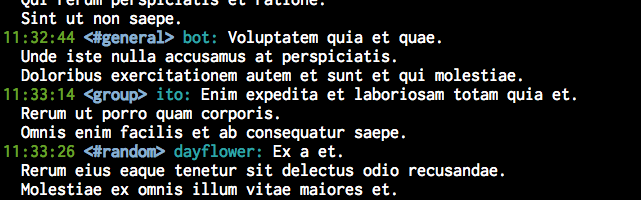

# slack-hidarishita

Slack post stream viewer

## Installation

Just clone this repository:

    $ git clone https://github.com/dayflower/slack-hidarishita.git

Install gems:

    $ bundle install --path vendor/bundle

## Execution

    $ SLACK_API_TOKEN=xxxx bundle exec ruby slack-hidarishita.rb

You must specify your user token in `SLACK_API_TOKEN` environment variable.

This software uses `dotenv` gem, so you can specify it in `.env` file on current directory.

## Customizing

You can mute channels / users you want.

Copy `config.yml.example` to `config.yml` and customize it.

If you want to change appearance, modify the code.

## Contributing

Bug reports and pull requests are welcome on GitHub at https://github.com/dayflower/slack-hidarishita.

## License

The gem is available as open source under the terms of the [MIT License](https://opensource.org/licenses/MIT).
